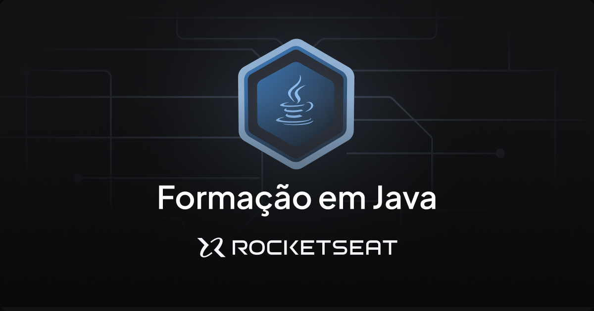

# Ignite | Fundamentos do Java



Este repositório contém todos os códigos sobre a aula de Fundamentos do Java da [Rocketseat](https://app.rocketseat.com.br/).

## Conteúdo

- [X] Main
- [X] Tipo de Dados
- [X] Estrutura de Repetição
- [X] Estrutura de Dados Lista
- [X] Hash Map
- [X] Hash Set
- [X] POO
- [X] Encapsulamento
- [X] Herança
- [X] Polimorfismo
- [X] Exceções
- [X] Constutor
- [X] Wrapper de Classes

## O que aprendi

### Main

Para executar um código java, basta fazer:

```
java Aquivo.java
```

Além disso, toda execussão começa com uma `Main` que é uma classe:

```java
public class MinhaClasse {
    public static void main(String[] args) {
        // Seu código aqui
    }
}
```

A main sempre tem a mesma estrutura e tem nível de acesso `public` e é `static` sem retorno `void`.

### Tipo de Dados

O java é dividido em tipos _Primitivos_ e _Referência_.

Os tipos primitivos são:

[Inteiros]

* byte: 8 bits, intervalo de -128 a 127
* short: 16 bits, intervalo de -32768 a 32767
* int: 32 bits, intervalo de -2^31 a 2^31-1
* long: 64 bits, intervalo de -2^63 a 2^63-1

[Ponto Flutuante]

* float: 32 bits, representação de ponto flutuante de precisão única
* double: 64 bits, representação de ponto flutuante de precisão dupla (mais comum)

[Caracteres]

* char: 16 bits, representa um caractere Unicode

[Booleano]

boolean: Representa valores verdadeiro ou falso

### Estrutura de Repetição

As estruturas de repetição possíveis são `for`, `while`, `do while` e métodos internos, como `forEach`.

```java
int valorInicial = 0;
while (valorInicial < 3) {
    System.out.println("O valor inicial é menor que 3");
    valorInicial++;
}

for(int i = 0; i < 20; i++) {
    System.out.println(i);
}
```

### Estrutura de Dados Lista

Nas estruturas de dados de lista, há os `HashMaps` e os `HashSets`.

No `HashMap` é a coleção de chave e valor:

```java
import java.util.HashMap;
import java.util.Map;

public class ColecaoHashMap {
    
    public static void main(String[] args) {
        Map<String, Integer> notas = new HashMap<>();

        notas.put("Matheus", 10);
        notas.put("Carlos", 9);
        notas.put("Lucas", 7);
        notas.put("João", 8);
        notas.put("Vinicius", 1);
        notas.put("Debora", 5);
        notas.put("Luiz", null);

        for(Map.Entry<String, Integer> entry: notas.entrySet()) {
            String key = entry.getKey();
            Integer value = entry.getValue();

            System.out.println("A chave é " + key + " e o valor é " + value);
        }
    }
}
```

No `HashSet` é a coleção de valores que são únicos independente da quantidade de inserções repetidas:

```java
import java.util.HashSet;
import java.util.Random;
import java.util.Set;
import java.util.Iterator;

public class ColecaoHashSet {
    public static void main(String[] args) {
        long seed = 100;
        Random randomNumber = new Random(seed);
        Set<Integer> numeros = new HashSet<>();
        
        while(numeros.size() < 10) {
            Integer numeroAleatorio = randomNumber.nextInt(100);
            numeros.add(numeroAleatorio);
        }

        Iterator<Integer> iterator = numeros.iterator();
        while(iterator.hasNext()) {
            int numero = iterator.next();
            if(numero % 2 == 0){
                iterator.remove();
            }
        }

        System.out.println("HashSet após a remoção dos pares: " + numeros);
    }
}
```

### POO

Programação Orientada a Objetos (POO) é um paradigma da programação que utiliza objetos, que são instâncias de classes, para organizar o código.

Há 4 princípios para isso:

* Abstração
* Encapsulamento
* Herança
* Polimorfismo

### Encapsulamento

O encapsulamento à prática de esconder os detalhes internos de uma classe e restringir o acesso direto aos seus atributos (variáveis de instância) e métodos. O encapsulamento é alcançado através da definição de atributos como privados (usando o modificador private) e fornecendo métodos públicos (também chamados de métodos de acesso) para interagir com esses atributos.

Existem três tipos principais de modificadores de acesso em java:

* Public (public)
* Private (private)
* Protected (protected)

Para acesso a esses atributos, é necessário usar o conceito de `getters` e `setters`, no qual cada atributo tem um `get` e um `set` para acesso e modificação.

```java
public class Exemplo(){
    private String valor;

    public void setValor(String valor){
        this.valor = valor;
    }

    public String getValor(){
        return this.valor;
    }
}
```

### Herança

A herança permite que uma classe herde características (métodos e campos) de outra classe, promovendo a reutilização de código e a criação de uma hierarquia de classes.

Por exemplo, tomemos um objeto com a classe Pessoa.

```java
public class Pessoa {
    private String nome;
    private Integer idade;
    private String cpf;
}
```

Se você cria outros objetos, como Aluno e Professor que heram Pessoa, então os campos de Pessoa se mantem, tendo apenas que adicionar um campo novo para cada classe:

```java
public class Aluno extends Pessoa{
    private String matricula;
}
```

```java
public class Professor extends Pessoa{
    private double salario;
}
```

### Polimorfismo

O polimorfismo refere-se à capacidade de um objeto se comportar de várias maneiras. Isso é alcançado por meio de dois conceitos principais: sobrecarga (overloading) e sobreposição (overriding).

Por exemplo em Pessoa, tem o método `imprimirDadosDaPessoa`. Para fazer o polimorfismo para os outras basta usar o `@Override`.

```java
public class Pessoa {
    private String nome;
    private Integer idade;
    private String cpf;

    public void imprimirDadosDaPessoa() {
        System.out.println("Nome: " + this.nome);
        System.out.println("Idade: " + this.idade);
        System.out.println("CPF: " + this.cpf);
    }
}
```

```java
public class Professor extends Pessoa{
    private double salario;

    @Override
    public void imprimirDadosDaPessoa() {
        super.imprimirDadosDaPessoa();
        System.out.println("Salário: " + this.salario);
    }
}
```

### Exceções

As exceções são eventos que ocorrem durante a execução de um programa e que interrompem o fluxo normal de execução. Essas situações excepcionais podem surgir devido a erros de programação, condições imprevistas ou falhas em tempo de execução (runtime). O tratamento de exceções em java é feito por meio do uso de blocos try, catch e finally.

```java
package excecoes;

// Existem dois tipos de exceção. As checadas e as não checadas.

public class Excecoes {
    public static void main(String[] args) {
        try{
            validarNumro(10);
        }catch(Exception e){
            System.out.println("Deu ruim!");
            e.printStackTrace();
        }
    }

    public static void validarNumro(int numero) throws Exception{
        if(numero < 100) {
            throw new Exception("O número é menor que 100");
        }
    }
}
```

### Constutor

Cada classe java tem um construtor e ele é iniciado automaticamente quando a classe é instanciada. É possível ter mais de um construtor.

```java
public class Construtor {

    private int numero;
    private String texto;

    public Construtor(int numero, String texto){
        this.numero = numero;
        this.texto = texto;
    }

    public Construtor(int numero) {
        this.numero = numero;
    }

    public void setNumero(int numero) {
        this.numero = numero;
    }

    public int getNumero() {
        return numero;
    }

    public String getTexto() {
        return texto;
    }

    public void setTexto(String texto) {
        this.texto = texto;
    }
}
```

```java
public class TesteDeConstrutor {
    public static void main(String[] args) {
        Construtor construtor1 = new Construtor(0);
        Construtor construtor2 = new Construtor(0, "meu texto");
        
    }
}
```

### Wrapper de Classes

os `wrappers` de classes são classes que fornecem um invólucro ao redor dos tipos primitivos. Isso permite que você trate tipos primitivos como objetos.

```java
public class Wrapper {
    public static void main(String[] args) {
        // Tipos primitivos
        int tipoInt = 1;
        float tipoFloat = 1;
        boolean tipoBoolean = false;

        // Wrappers
        Float tipoFloat2 = 1F;        // Wrapper para float
        Boolean tipoBoolean2 = false; // Wrapper para boolean
        Integer tipoInteger2 = 1;     // Wrapper para int
    }
}
```

## Agradecimentos

Agradeço à [Rocketseat](https://app.rocketseat.com.br/) e aos professores pela excelência nas aulas, que têm sido fundamentais para o meu crescimento profissional. A qualidade do conteúdo proporcionado é uma fonte constante de inspiração. Muito obrigado!